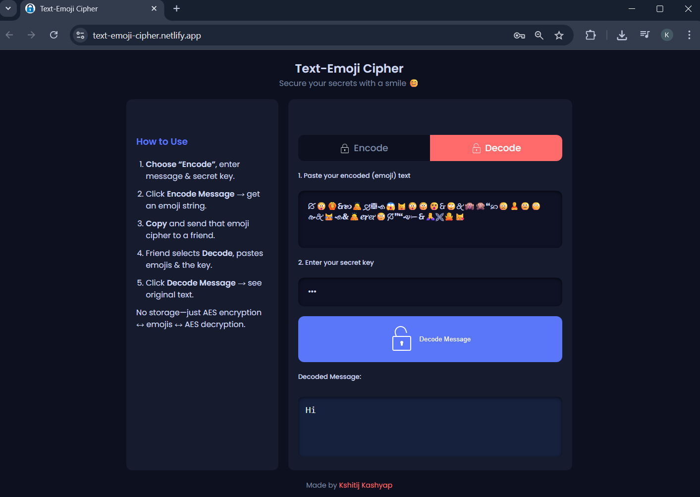

# 🔐 Text-Emoji Cipher

**Text-Emoji Cipher** is a React-based web app that lets you securely encrypt and decrypt messages using AES encryption and have fun sharing them as emoji strings! No servers, no storage—just your browser, your secret key, and a smile 😊.

---

## ✨ Features

- 🔒 **AES Encryption:** Industry-standard AES keeps your message safe.  
- 🎉 **Emoji Cipher:** Convert encrypted Base64 into a string of emojis.  
- 🌐 **Stateless & Client-Side:** Everything happens in your browser—no backend.  
- 📋 **Copy & Share:** One-click copy of the emoji cipher for easy sharing.  
- 📱 **Responsive UI:** Works beautifully on desktop and mobile.  
- 📖 **Built-in Guide:** Step-by-step “How to Use” instructions.  
- 🏷️ **Header & Footer:** Branded with your name & personal link.

---

## 📸 Screenshots

  


---

## 🛠️ Installation

1. **Clone** the repo:
   ```bash
   git clone https://github.com/kshitij7704/Text_to_Emoji_Encoder.git
   cd Text_to_Emoji_Encoder
   ```
2. **Install** dependencies:
   ```bash
   npm install
   ```
3. **Run** locally:
   ```bash
   npm start
   ```
4. **Build** for production:
   ```bash
   npm run build
   ```

---

## 📁 Project Structure

```
Text_to_Emoji_Encoder/
├── public/
│   ├── index.html
│   ├── lock.png
│   ├── unlock.png
│   └── arrow.png
├── src/
│   ├── components/
│   │   ├── Header.jsx
│   │   ├── Footer.jsx
│   │   ├── Steps.jsx
│   │   ├── Encoder.jsx
│   │   └── Decoder.jsx
│   ├── App.jsx
│   ├── index.js
│   └── style.css
├── package.json
└── README.md
```

---

## 🔍 Usage

### 🖋️ Encode

1. Select the **Encode** tab.  
2. Enter your message and a secret key.  
3. Click **Encode Message** 🔐 to generate your emoji cipher.  
4. Click **Copy Emoji Cipher** 📋 and share it!

### 🔓 Decode

1. Select the **Decode** tab.  
2. Paste the emoji cipher and enter the same secret key.  
3. Click **Decode Message** 🔓 to reveal the original text.

---

## 🚀 Deployment

Deploy on Netify, URL: https://text-emoji-cipher.netlify.app/

---

## 🧰 Technologies

- **React**  
- **Crypto-JS** (AES)  
- **JavaScript (ES6+)**  
- **HTML5 & CSS3**  
- **Poppins Font** from Google Fonts

---

## 👨‍💻 Author

**Kshitij Kashyap**  
🌐 [LinkedIn](https://www.linkedin.com/in/kshitij-kashyap-133205264/) <br>
💻 [GitHub](https://github.com/kshitij7704)
